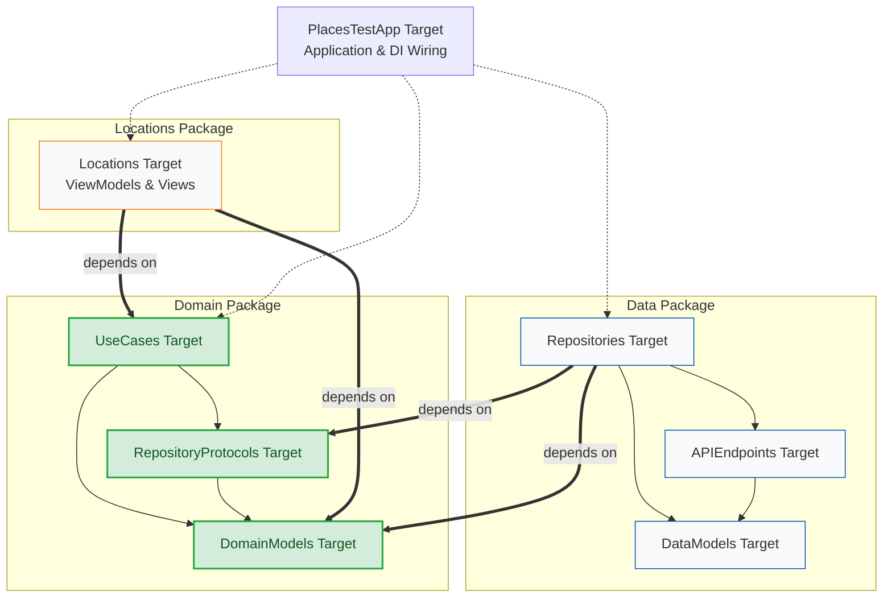

# iOS Assignment — Wikipedia Places Deep Link & Test App

This repository contains the deliverables for the Franx / ABN AMRO iOS assignment. It consists of two parts:
1. **Modified Wikipedia App:** Forked and modified to accept a deep link that opens the 'Places' tab centered on a specific coordinate, bypassing the user's current location.
2. **PlacesTestApp:** A standalone test app that fetches a list of locations, allows custom coordinate entry, and triggers the new deep link.

## 🛠 Tech Stack & Core Concepts

* **UI:** SwiftUI
* **State Management:** `@Observable`
* **Architecture:** Clean Architecture & MVVM-C (Model-View-ViewModel-Coordinator)
* **Concurrency:** Swift Concurrency (`async/await`, `@MainActor` isolation)
* **Structure:** Heavily Modularized (Swift Package Manager)
* **Quality:** High Accessibility standards and unit tests

## 🏗 Architecture & Modularization

The `PlacesTestApp` is built using **Clean Architecture** and split into three distinct local Swift Packages to enforce separation of concerns and strict dependency rules. The UI layer is driven by the **MVVM-C** pattern, where a UIKit Coordinator hosts SwiftUI views.

* **Domain:** Pure Swift, no UI. Contains entities (`Location`), use cases, and repository interfaces.
* **Data:** Implements the Domain's repository interfaces. Handles networking (`URLSession.data(from:)`) and DTO mapping.
* **Locations (Presentation):** Contains the Coordinators, `@Observable` ViewModels, and SwiftUI views. Operates with `@MainActor` default isolation.

## 🔗 The Deep Link Contract

The modified Wikipedia app listens for the following scheme:
`wikipedia://places?latitude=<lat>&longitude=<lon>[&name=<label>]`

* **`latitude` / `longitude`:** Required. Decimal degrees.
* **`name`:** Optional. Human-readable label.
* *Backward Compatibility:* `wikipedia://places` with no coordinates retains its original behavior.

## 🚀 How to Run the End-to-End Demo

1.  **Build Wikipedia:** Open `Wikipedia.xcodeproj`, build, and run the **Wikipedia** scheme on an iOS 17+ Simulator. (This installs the app and registers the URL scheme). *Note: Use Xcode 26.2 to match Wikipedia's CI environment if building from source.*
2.  **Build the Test App:** Open `PlacesTestApp/PlacesTestApp.xcworkspace`, build, and run **PlacesTestApp** on the **same simulator**.
3.  **Test:** Tap a fetched location or add a custom one. Wikipedia will open directly to the Places tab at your chosen coordinates.
